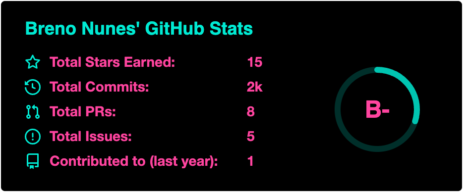

### Hello there 👋, I'm Brenovit...

...a Software Engineer from &#x1f1e7;&#x1f1f7; living in &#127475;&#127473;/Utrecht

- 🔭 I have experience with: Java/Kotlin, TypeScript, Mongo, Azure, Docker an much more.
- 🌱 I’m currently learning BlockChain, GameDevelopment, Agentic AI
- 💬 Ask me about anything... and I like software, animes, life, games, food
- 📫 How to reach me: 
- ⚡ Fun fact: I like coffe and I love tea

[

⭐️ From [brenovit](https://github.com/[brenovit])
